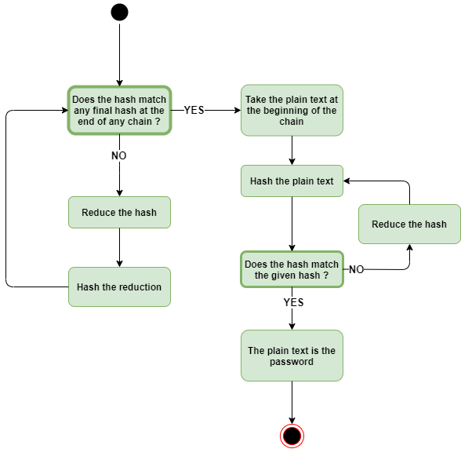
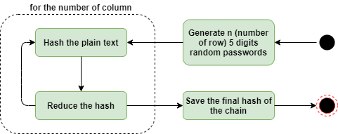

# RUDA - Rainbow table password cracking CUDA implemetation

```text
Usage :
      -hash=HASH [0] (Password hash you want to crack)
      -block=BLOCK [4] (Rainbow table's row count (1 block = 1024 row))
      -depth=DEPTH [4096] (Rainbow table's column count)
      -verbose (Display the rainbow table)
```

## Purpose

This algorithm is entended to find the plain text password composed of **5 digits** from the corresponding hash. This implementation use the CUDA parallelism paradigm to lower the computation time

## Rainbow tables

### The algorithm

|  |
|:--:|
| *Rainbow table algorithm* |

The rainbow table algorithm consist in multiple hashing / reduction iteration in order to find a matching entry into on the the final chain value. If a match is found, the program will come back at the beginnig of the given chain and run through the entire chain until a match is found.

### The hashing function

```cpp
__device__
void hashingKernel(unsigned int plain, unsigned int *hash)
{
    // Hashing kernel (36669 => 174576660)
    *hash = ((plain >> 16) ^ plain) * 0x45;
    *hash = ((*hash >> 16) ^ *hash) * 0x45;
    *hash = (*hash >> 16) ^ *hash;
}
```

This hashing function shift multiple time the plain text value in order to generate a hash without any collision.

*Example : hashingKernel(36669) = 174576660*

### The redcution function

```cpp
__device__
void reductionKernel(unsigned int maxValue, unsigned int hash, unsigned int *reduction)
{
    // Reduction kernel (174576660 => 17457)
    while (hash > maxValue)
    {
        hash = hash / 10;   
    }
    *reduction = hash;
}
```

This reduction function will take the first **5 digits** of the hash in order to get an usable plain text password value.

*Example : reductionKernel(174576660) = 17457*

## Implementation

### Generating the random value

In order to start the rainbow table algorithm, we have to generate the initial table with random values. The user have the possibility to chose the size of the table by passing the number of column and block (1 block = 1024 rows). Each chain (1 chain per row) will be handle by one thread.

|  |
|:--:|
| *Value generation* |

### Find the corresponding password

When the table is generated, each thread will handle one chain composed of the plain text value and the final hash. Theay will perform the rainbow table algorithm to found the hash *(cf. first schema)*.

If one of them find the correct password, a global boolean *found* will set to **true** to notify to each thread of each block that they can stop their job.

Sometimes, no password exist for a given hash. To prevent the program running indefinitely, a global variable *iteration* is incremented each time a thread needs to reduct and hash a plain text password. If this value reach 100,000, the program stops notifying the user that there is no password matching this hash value